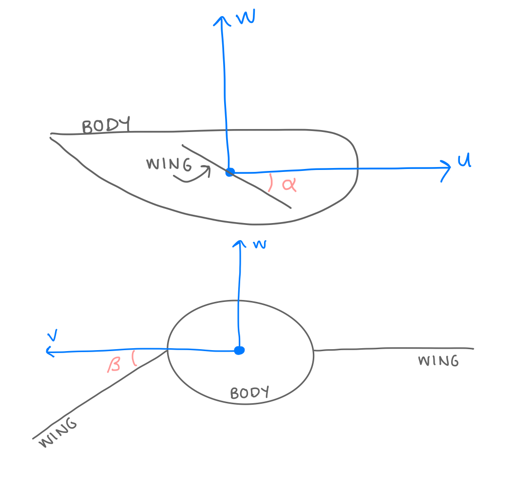

## Run

install: `pip install pettingzoo pybind11`

compile: `bash build.sh`

run example: `python solver_tester`

NOTE: need to compile before running python code

### Code outline

Python:

* `flocking_env.py`: The PettingZoo environment.
* `plotting.py`: Plot utilities
* `solver_tester.py`: Tests bird flocking
* `test_flocking_api.py`: Tests the PettingZoo environment API (unmaintained as of Mar 7)

C++:

* `basic.cpp`: C++ testing code
* `bird.cpp`: Bird data structure, bird history
* `DiffEqs.cpp`: RK4 Differential equation solver
* `flock.cpp`: Environment level data structure
* `py_interface.cpp`: Python interface for environment
* `vortex.cpp`: Vortex data structure

### Environment Parameters
- **N**: number of birds (if bird_inits is None)
- **h**: seconds per frame (step size)
- **t**: maximum seconds per episode
- **energy_reward**: the reward for a bird using energy (negative to -incentivize limiting energy use)
- **forward_reward**: the reward for a bird moving forward
- **crash_reward**: the reward for a bird crashing into another bird or the ground
- **max_observable_birds**: the number of neighboring birds a bird can see
- **bird_inits**: initial positions of the birds (None for default random sphere)
- **LIA**: boolean choice to include Local approximation for vortice movement
- **bird_filename**: the file you want to log the bird states in
- **vortex_filename**: the file you want to log the vortex states in
- **vortex_update_frequency**: Period of adding new points on the vortex line.

### Actions
An action is a normalized 0-1 5-vector where each index represents:
   - 0: Thrust, a forward force on the bird, 0 N to 10 N
   - 1: alpha rotation of left wing (in degrees), -0.01 deg to 0.01 deg
   - 2: beta rotation of left wing (in degrees), -0.01 deg to 0.01 deg
   - 3: alpha rotation of right wing (in degrees), -0.01 deg to 0.01 deg
   - 4: beta rotation of right wing (in degrees), -0.01 deg to 0.01 deg

### Observations
Observation space is a vector with
    20 dimensions for the current bird's state and
    9 dimensions for each of the birds the current bird can observe.

   Bird's state observations:
  - 0-2:    Force (N) on the bird in each direction (fu, fv, fw)
  - 3-5:    Torque (N m) on the bird in each direction (Tu, Tv, Tw)
   - 6:    Bird's height (z)
   - 7-9:  Bird's orientation (degrees) (phi, theta, psi)
   - 10-11:  Left wing orientation (degrees) (alpha, beta)
   - 12-13:  Right wing orientation (degrees) (alpha, beta)

   The following velocity and angular velocity observations are only included if derivative_in_obs is set to True.

   - 14-16:   Bird's velocity (m/s) in each direction (u, v, w)
   - 17-19:  Bird's angular velocity (degrees/s) in each direction (p, q, r)

 Following this, starting at observation 20, there will be
 9-dimension vectors for each bird the current bird can observe.
Each of these vectors contains:
- 0-2:    Relative position to the current bird
- 3-5:   Other bird's orientation (phi, theta, psi)

The following velocity observation is only included if derivative_in_obs is set to True.

- 6-8:  Other bird's relative velocity (u, v, w)

### Bird Values
A bird's position, orientation, and movement are defined by several variables.

- **Position**: A bird's position vector is defined by **(x, y, z)**. This is the bird's x, y, and z position in the Earth's frame. The position of the center of the bird is always (0,0,0) in the bird's frame.

- **Orientation**: A bird's orientation is defined by 3 Euler angles, **(phi, theta, psi)**.  Each of these angles is a rotation (in degrees) around an axis in the bird frame.
- **Velocity**: A bird's velocity is defined by **(u, v, w)**. These are the values for velocity along the 3 main axes in the bird frame.

- **Rotaional Velocity**: A bird's angular velocity is defined by **(p, q, r)**. These are the rates of rotation around each of the 3 main axes in the bird's frame.

- **Wing Orientation**: The wings can be adjusted in two ways, rotated forward and backward (**alpha**) or rotated up and down (**beta**).

### Simulation Equations

The position, velocity, Euler angles, and angular velocity are calculated every time step using a numerical differential equations solver. Each of these properties is described by a differential equation in time. Here are the equations that describe each type of motion.

**Position**

The "E" subscript indicates that this value is in the earth's frame. Unless ptherwise stated, all other values are in the bird's frame.
The equations are shortened, s is sine,c is cosine, and t is tangent.
Differential Equation:

Matrix Form:

**Velocity**
The differential equation for velocity is
m is the bird's mass.
(X, Y, Z) is the force the bird experiences in each direction.

Differential Equation:

Matrix form:

**Angles**

Differential Equation:

Matrix Form:

The angular rotations are rotated from the Earth's frame into the bird's frame.

**Angular Velocity**

Differential Equation:

- M is the torque vector (represented as (L, M, N) in the code)
- I is the inertia matrix

Matrix Form:

- (L, M, N) is the torque in the (u,v,w) direction.
- Ix, Iy, Iz are the moments of inertia

### Vortices

A vortex is defined by a line in space that represents the center of the vortex at each point along the line. Birds will "drop" new points on this line after a set number of frames, and points will go out of existence after a certain amount of time as the vortices lose strength and disappear.

If a bird is close enough to a vortex line to be affected by its vortex, it searches for the nearest defined point on the vortex line and uses the strength and orientation from that point to calculate any forces due to the vortex.

The velocity of air caused by the vortex is defined by the Burnham-Hallock model. This is a velocity in the direction of air motion (tangent velocity).

Parameters:
- gamma: the strength of the vortex
- r: the distance from the center of the vortex
- rc: the size of the "vortex core", an area with no motion at the center of the vortex.

**Local Induction Approximation**

The local induction approximation (LIA) is a differential equation that describes how the vortex line induces motion in itself due to its own curvature.

The simulation calculates new values for points from oldest to newest, using the last calculated point to determine the value of the next point.

This diagram shows the values needed from each point.
- n is the last point calculated on the line
- n+1 is the next point on the line
- r: position in space
- t: the tangent vector
- n: the normal vector
- b: the binormal vector

Using these calculated values, the final velocity of a point on the vortex line is:

.

Where epsilon is the distance between points.

This velocity is then used to calculate position using the same numerical differential equation solver as used in the rest of the project.
